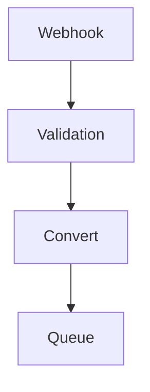

# CD Events Adapter

[](https://github.com/hashi-at-home/cdevents-adapter/actions/workflows/main.yml)

CD Events Adapter built to run on Cloudflare

This adapter is designed to receive webhooks from external sources such as
GitHub, GitLab, Jira, _etc_, validate them and convert them to CD Events.
Canonical CD Events are then placed on a relevant queue for further processing.



Types and validation are handled by Zod, while the API itself is built using Hono.
The API is intended to be deployed as a Cloudflare Worker, but can be deployed using different runtimes.

## Development environment

We use [mise](https://mise.jdx.dev) to configure the development environment.
See `mise.toml` for details.
In order to use Mise, you need to install it in your development environment first.

```shell
mise trust
mise install
```

```txt
npm install
npm run dev
```

```txt
npm run deploy
```

[For generating/synchronizing types based on your Worker configuration run](https://developers.cloudflare.com/workers/wrangler/commands/#types):

```txt
npm run cf-typegen
```
